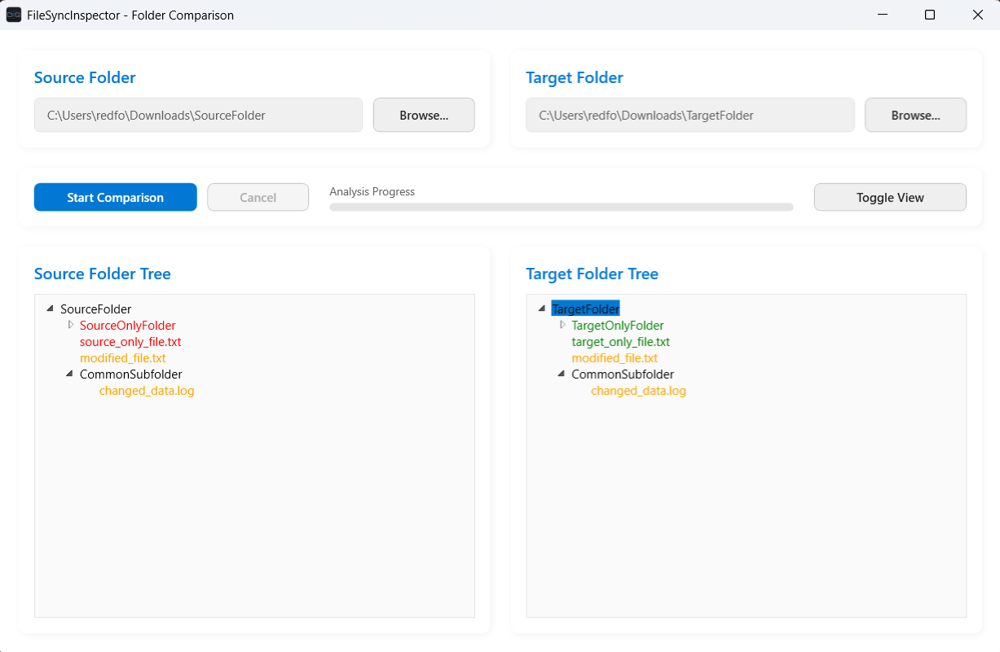

# FileSyncInspector

_Read this in other languages: [English](#english), [Čeština](#čeština)._

---

## 🇬🇧 English

### Project Description

**FileSyncInspector** is a clear and lightweight Windows desktop utility designed for inspecting and comparing the contents of two directories.

It is built to ensure that file copying or synchronization between two locations was successful and completed without any data loss or corruption. The application doesn't just check for the existence of files and folders; it performs a **deep byte-by-byte comparison** of shared files to detect any hidden corruption or modifications.

### Why use FileSyncInspector?

- **Fast & Reliable:** Quickly verify the completeness and integrity of data after large file transfers.
- **Error Detection:** Identify missing, corrupted, or altered files with precision.
- **Modern UI:** Features a clean, Fluent-inspired design with a responsive layout.
- **Bilingual:** Fully supports English and Czech localization out of the box.
- **Intuitive Output:** Review differences easily using either a structured TreeView or a raw text log.
- **Visual Feedback:** Color-coded results for instant clarity:
  - 🔴 **Red:** Missing items.
  - 🟢 **Green:** Added items.
  - 🟠 **Orange:** Modified/Corrupted items (detected via byte-level scan).

### Typical Use Cases

- Verifying the integrity of important backups (documents, projects, photo libraries).
- Detecting silent data corruption (bit rot) on failing hard drives or external storage.
- Comparing two versions of a project folder to ensure they are 100% identical.

### Core Features

- **Recursive Scanning:** Deep inspection of folders including all sub-directories.
- **Byte-by-Byte Comparison:** Memory-efficient scanning utilizing a 1MB stream buffer.
- **Asynchronous Execution:** UI remains fully responsive during heavy disk I/O operations with a real-time progress bar.
- **Dual View Mode:** Seamless toggle between Text output and TreeView output.
- **Cancellation:** Ability to safely abort long-running comparison tasks.

---

## 🇨🇿 Čeština

### Popis projektu

**FileSyncInspector** je jednoduchá a přehledná desktopová aplikace pro Windows, která slouží k detailnímu porovnávání dvou složek.

Je navržena pro snadné ověření, že kopírování souborů nebo synchronizace mezi dvěma místy proběhla správně a bez ztráty dat. Aplikace zkontroluje nejen přítomnost všech souborů a složek, ale provádí také **hloubkovou kontrolu bit po bitu** u společných souborů. Tím spolehlivě odhalí poškozená, chybějící nebo skrytě změněná data.

### Proč FileSyncInspector?

- **Rychlost a spolehlivost:** Rychlá kontrola kompletnosti a integrity dat po přenosu velkých objemů.
- **Detekce chyb:** Přesné odhalení chyb při kopírování.
- **Moderní UI:** Čistý Fluent Design s responzivním rozložením.
- **Vícejazyčnost:** Plná podpora češtiny a angličtiny (přepíná se automaticky dle systému).
- **Intuitivní výstup:** Přepínání mezi textovým výpisem a přehlednou stromovou strukturou (TreeView).
- **Vizuální rozlišení:** Barevné označení stavů:
  - 🔴 **Červená:** Chybějící položky.
  - 🟢 **Zelená:** Přidané položky.
  - 🟠 **Oranžová:** Modifikované/poškozené položky (zjištěno bitovým srovnáním).

### Typické scénáře použití

- Ověření integrity záloh důležitých dokumentů či projektů.
- Detekce poškozených souborů na diskových oddílech s podezřením na selhání hardwaru.
- Porovnání dvou verzí složek, zda jsou 100% identické.

### Hlavní funkce

- **Rekurzivní prohledávání:** Analýza složek včetně všech vnořených podsložek.
- **Porovnávání bit po bitu:** Efektivní čtení souborů pomocí 1MB bufferu.
- **Asynchronní běh:** Uživatelské rozhraní (WPF) nezamrzá a neustále ukazuje plynulý průběh (Progress Bar).
- **Přepínání zobrazení:** Možnost volby mezi detailním textovým logem a grafickým stromem.
- **Zrušení akce:** Možnost kdykoliv bezpečně přerušit náročné porovnávání.
